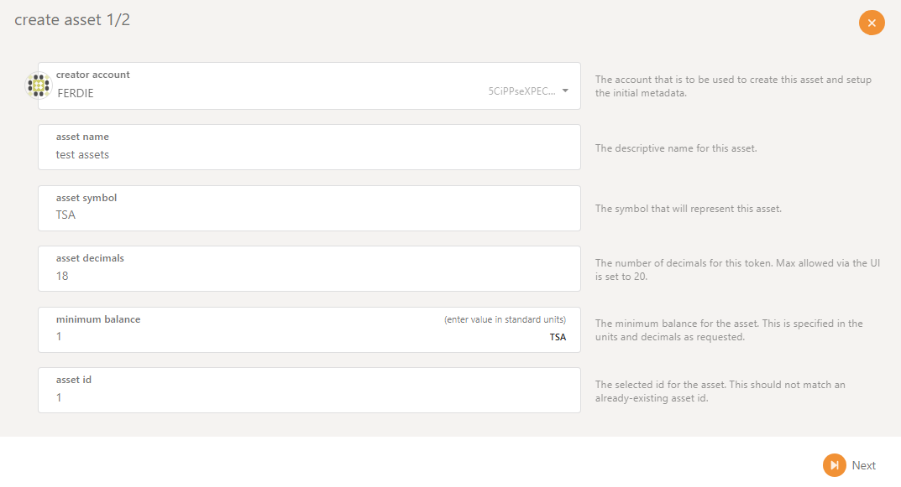
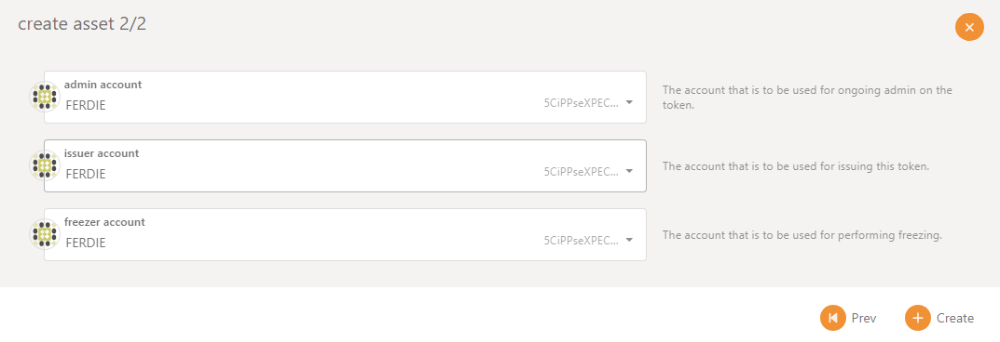
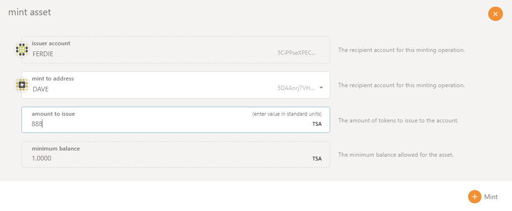
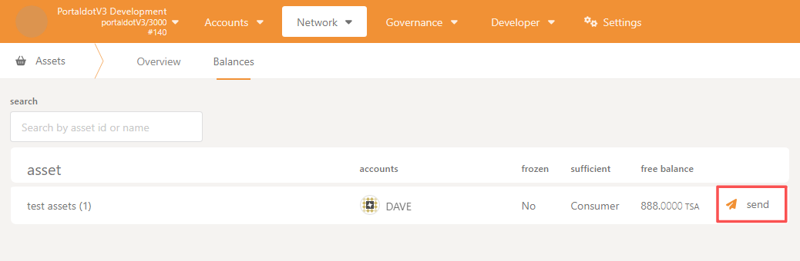
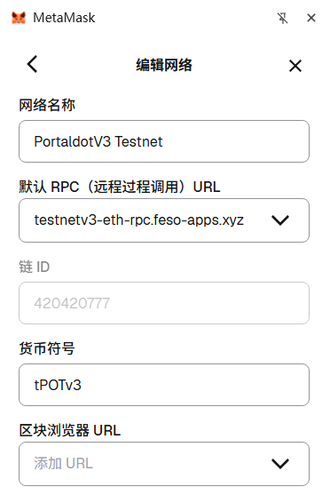
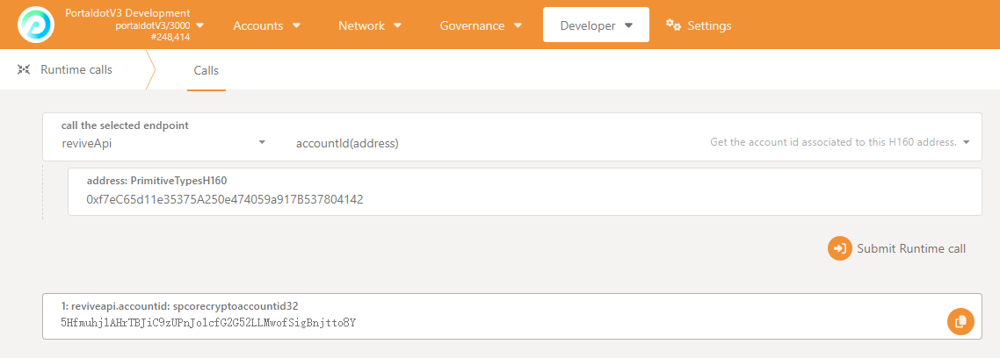
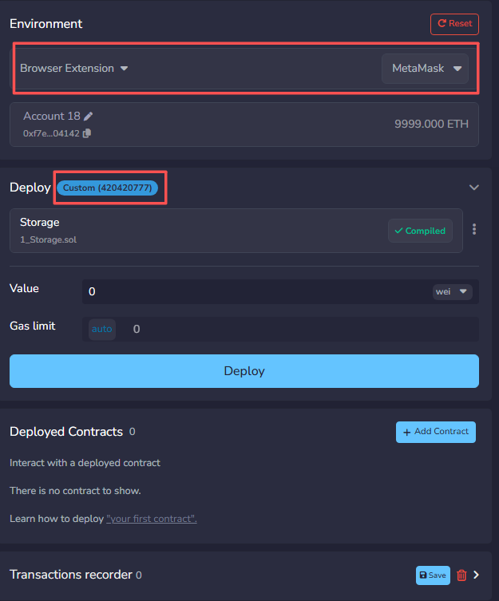
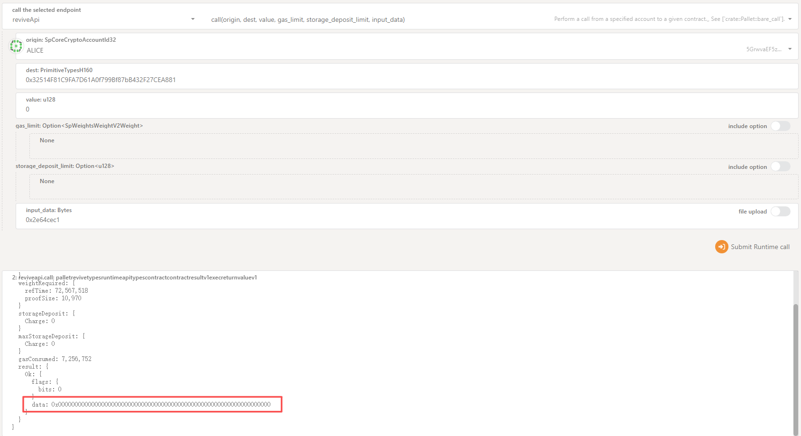
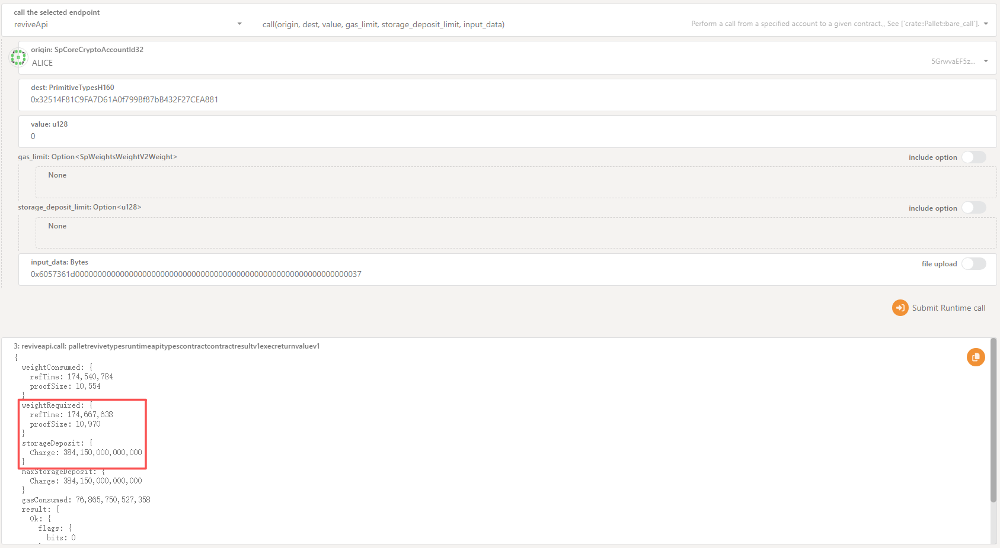
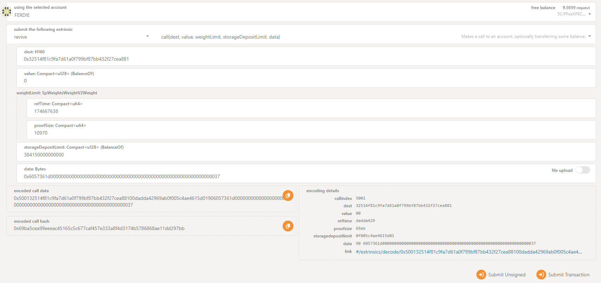

# PortaldotV3 Testnet Guide

> Official PortaldotV3 Testnet documentation and sample code, provided by the Portaldot team.
> English translation of the original document *PortaldotV3 Testnet说明文档*.

## Contents

1. [Basic Information](#1-basic-information)
- [1.1 Endpoints and Token](#11-endpoints-and-token)
- [1.2 Node Explorer](#12-node-explorer)
- [1.3 Sample Code](#13-sample-code)
2. [Native Asset Modules](#2-native-asset-modules)
- [2.1 Assets](#21-assets)
- [2.2 Uniques](#22-uniques)
- [2.3 Nfts](#23-nfts)
3. [Solidity Contracts](#3-solidity-contracts)
- [3.1 Tool Setup](#31-tool-setup)
- [3.2 Contract Deployment](#32-contract-deployment)
- [3.3 Contract Interaction](#33-contract-interaction)
- [3.4 Example](#34-example)

**Sample code** (in the [`demo/`](demo/) folder):

| File | Covers |
|---|---|
| [`00_base_demo.py`](demo/00_base_demo.py) | Accounts, signing, chain queries, transfers, offline signing |
| [`01_assets_demo.py`](demo/01_assets_demo.py) | Fungible assets (`Assets` pallet) |
| [`02_uniques_demo.py`](demo/02_uniques_demo.py) | Basic NFTs (`Uniques` pallet) |
| [`03_nfts_demo.py`](demo/03_nfts_demo.py) | Advanced NFTs (`Nfts` pallet) |
| [`04_solidity_demo.py`](demo/04_solidity_demo.py) | Interacting with Solidity contracts via Substrate tooling |

---

## 1. Basic Information

### 1.1 Endpoints and Token

| Item | Value |
|---|---|
| RPC Endpoint | `wss://testnetv3-node.feso-apps.xyz` |
| Node Explorer | https://node-console.feso-apps.xyz/ |
| Token Symbol | `tPOTv3` |
| Token Decimals | `14` |

### 1.2 Node Explorer

- **Accounts page:** basic account operations, including creating, backing up and forgetting accounts.
- **Network page:** view the latest blocks and events, staking information and asset information.
- **Governance page:** view information such as the Treasury and the Technical Committee.
- **Developer page:** interact with the chain through its interfaces, encrypt data, and sign/verify signatures.

### 1.3 Sample Code

See the sample code [`00_base_demo.py`](demo/00_base_demo.py). It depends on `substrate-interface`; install it before running:

```bash
pip install substrate-interface
```

---

## 2. Native Asset Modules

### 2.1 Assets

#### 2.1.1 Introduction

The Assets module manages multiple fungible assets on-chain in addition to the native token. It natively supports issuing and managing many custom tokens **without relying on smart contracts** (such as ERC-20). Core features:

- **Asset creation and management:** any account can create a new asset, specifying the asset ID, precision (`decimals`), minimum balance (`min balance`) and other metadata.
- **Minting and burning:** the asset's **Issuer** role can mint new units (`mint`); the **Admin** role can burn units (`burn`).
- **Transfers:** supports regular transfers, `transfer_keep_alive`, batch transfers, etc.
- **Separated permission roles:** each asset has four management roles:
  - **Owner:** owns the asset; can modify metadata and transfer roles.
  - **Issuer:** can mint new units.
  - **Admin:** can burn units and freeze accounts.
  - **Freezer:** can freeze/unfreeze the asset balance of individual accounts.
- **Account freezing:** the asset balance of a specific account can be frozen to block its transfers (commonly used for compliance).
- **Asset metadata:** supports setting display information such as the asset name, `symbol` and decimals.
- **Approved transfers:** similar to ERC-20's `approve` / `transferFrom`, allowing an account to authorize a third party to transfer up to a certain amount of its assets.
- **Destruction and lifecycle management:** supports freezing an asset and destroying an entire asset class (`destroy`).

#### 2.1.2 Asset Management

- **Asset creation / minting:** can be done in the Node Explorer under **Network → Assets**, for example:

  

  

  After creation, the asset can be minted to a given address:

  

- **Transfers:** you can transfer any asset you hold:

  

- **Other management:** can be performed through the interfaces on the **Developer** page.

#### 2.1.3 Sample Code

See [`01_assets_demo.py`](demo/01_assets_demo.py). It covers the following scenarios:

| Call | Description |
|---|---|
| `create` | Create an asset (Asset Admin/Owner) |
| `mint` | Mint (issue) additional units |
| `burn` | Burn units |
| `transfer` | Regular transfer |
| `freeze` | Freeze an account's asset balance |
| `thaw` | Unfreeze an account |
| `approve_transfer` | Authorize someone else to transfer on your behalf (approve) |
| `transfer_approved` | The approved party executes the transfer (like ERC-20 `transferFrom`) |
| `cancel_approval` | Revoke the approval |

### 2.2 Uniques

#### 2.2.1 Introduction

Uniques manages basic NFTs, natively implementing NFT creation, minting, transfer and metadata management on-chain.

Core concepts:

- **`Collection`:** an NFT collection. Each Collection has a unique `CollectionId`.
- **`Item`:** a specific NFT within a Collection, uniquely identified by the tuple `(CollectionId, ItemId)`.

Core features:

- **Create a collection:** any account can create a new Collection and becomes its `Owner`.
- **Mint items:** the Collection's `Issuer` role can mint specific NFT items under that Collection.
- **Transfer:** an Item can be transferred from one account to another.
- **Role management:**
  - **Owner:** owns the Collection.
  - **Issuer:** can mint new items.
  - **Admin:** can burn items and freeze/thaw.
  - **Freezer:** can freeze a specific Collection or Item.
- **Metadata management:**
  - Collection-level metadata (e.g. a description of the whole collection, image links).
  - Item-level metadata (properties of a single NFT).
- **Attributes:** arbitrary key-value attributes can be attached to a Collection or Item for extensibility.
- **Deposit mechanism:** creating a Collection, minting an Item and setting metadata all require a deposit, preventing junk data from piling up on-chain.
- **Destruction and lifecycle management:** supports burning a single Item or destroying an entire Collection (all items must be removed first).
- **Basic marketplace:** Items can be listed for sale and bought, priced in POT.

#### 2.2.2 Asset Management

Managed mainly through the interfaces. Basic information can be viewed on the **Network → Nfts** page.

#### 2.2.3 Sample Code

See [`02_uniques_demo.py`](demo/02_uniques_demo.py). It covers the following scenarios:

| Call | Description |
|---|---|
| `create` | Create a new NFT collection |
| `mint` | Mint a new NFT (item) in a collection |
| `burn` | Burn a specific NFT |
| `transfer` | Transfer NFT ownership |
| `freeze` / `thaw` | Freeze/unfreeze a single item (blocks transfers) |
| `freeze_collection` / `thaw_collection` | Freeze/unfreeze an entire collection |
| `approve_transfer` | Authorize someone else to transfer a given item on your behalf |
| `cancel_approval` | Revoke that approval |
| `set_metadata` / `set_attribute` | Set item metadata/attributes (commonly used in NFT scenarios) |
| `set_price` / `buy_item` | Built-in listing marketplace (similar to a simple NFT exchange) |

### 2.3 Nfts

#### 2.3.1 Introduction

Nfts is the upgraded version of Uniques — more complete and modern. Main enhancements over Uniques:

- **More flexible attribute namespaces (`AttributeNamespaces`):** attributes can be set and managed separately by different roles:
  - **CollectionOwner:** attributes set by the collection owner.
  - **ItemOwner:** attributes set by the item holder themselves.
  - **Account:** attributes set by any third-party account (e.g. for third-party apps/games to write custom data).
- **On-chain atomic swaps (`AtomicSwaps`):** two accounts can swap NFTs directly on-chain, barter-style, with no third-party escrow.
- **Finer-grained locking:** you can lock separately:
  - the collection's metadata
  - the collection's attributes
  - a single item's metadata/attributes
- **Collection configuration (`CollectionConfig`):** multiple switches can be configured at once when creating a collection (whether transfers are allowed, whether minting is public, etc.).
- **Public minting (`PublicMinting`) and mint settings (`MintSettings`):** supports setting mint start/end times, price, whitelist, etc. — suitable for sale/launch scenarios.
- **Delegated minting:** allows the CollectionOwner to authorize other accounts to mint according to rules.

#### 2.3.2 Asset Management

Managed mainly through the interfaces.

#### 2.3.3 Sample Code

See [`03_nfts_demo.py`](demo/03_nfts_demo.py). It covers the following scenarios:

| Call | Description |
|---|---|
| `create` | Create an NFT collection (requires a `CollectionConfig`) |
| `mint` | Mint an NFT |
| `burn` | Burn an NFT |
| `transfer` | Transfer an NFT |
| `lock_item_transfer` / `unlock_item_transfer` | Lock/unlock transfers of a single item (equivalent to freeze/thaw) |
| `lock_collection` | Lock the configuration of the whole collection (e.g. prevent further changes to settings) |
| `approve_transfer` | Authorize someone else to transfer an item on your behalf (an expiry block can be set) |
| `cancel_approval` / `clear_all_transfer_approvals` | Revoke approvals |
| `set_attribute` / `set_metadata` / `set_collection_metadata` | Metadata and attributes |
| `mint_pre_signed` | Offline pre-signed minting (whitelist / lazy-mint scenarios) |
| `set_price` / `buy_item` | Built-in listing marketplace (similar to a simple NFT exchange) |

---

## 3. Solidity Contracts

### 3.1 Tool Setup

#### 3.1.1 RPC Endpoint

| Item | Value |
|---|---|
| Network | PortaldotV3 Testnet |
| RPC Endpoint | `https://testnetv3-eth-rpc.feso-apps.xyz` |
| Chain ID | `420420777` |
| Symbol | `tPOTv3` |

#### 3.1.2 MetaMask

Add a custom network as follows:

| MetaMask field | Value |
|---|---|
| Network name | `PortaldotV3 Testnet` |
| Default RPC URL | `https://testnetv3-eth-rpc.feso-apps.xyz` |
| Chain ID | `420420777` |
| Currency symbol | `tPOTv3` |
| Block explorer URL | *(leave empty)* |



#### 3.1.3 Hardhat

```ts
import type { HardhatUserConfig } from 'hardhat/config';
import '@nomicfoundation/hardhat-toolbox';

// If you want to use a variable for your private key
import { vars } from 'hardhat/config';

const config: HardhatUserConfig = {
  solidity: '0.8.24',
  networks: {
    polkadotTestnet: {
      url: 'https://testnetv3-eth-rpc.feso-apps.xyz',
      chainId: 420420777,
      accounts: [vars.get('PRIVATE_KEY')],
    },
  },
};

export default config;
```

### 3.2 Contract Deployment

Solidity contracts can be deployed directly with EVM tooling. This guide uses **Remix IDE** as the example.

1. Prepare a contract deployer address — simply generate one with MetaMask.
2. Send test tokens to the deployer address. **The address must be converted before transferring** (see [3.4.2](#342-account-preparation)).

   > ⚠️ **Note:** The H160 address generated in Portaldot is only an address that conforms to the EVM address format; it is used for transaction fallback. **The H160 derived from the same private key/mnemonic is NOT the same as the address generated on Ethereum/BSC.**

3. Prepare the contract code.
4. Deploy the contract and note the contract address. The contract can be interacted with using either EVM tooling or Portaldot tooling.

### 3.3 Contract Interaction

#### 3.3.1 Via EVM Tooling

Essentially the same as interacting with any regular Solidity contract.

#### 3.3.2 Via Portaldot Tooling

1. Generate the calldata — this can be done with web3.js, web3.py, Remix IDE and similar tools.
2. Interact with the contract through Portaldot's on-chain interfaces.

### 3.4 Example

#### 3.4.1 Contract Code

```solidity
// SPDX-License-Identifier: GPL-3.0

pragma solidity >=0.8.2 <0.9.0;

/**
 * @title Storage
 * @dev Store & retrieve value in a variable
 * @custom:dev-run-script ./scripts/deploy_with_ethers.ts
 */
contract Storage {

    uint256 number;

    /**
     * @dev Store value in variable
     * @param num value to store
     */
    function store(uint256 num) public {
        number = num;
    }

    /**
     * @dev Return value
     * @return value of 'number'
     */
    function retrieve() public view returns (uint256){
        return number;
    }
}
```

#### 3.4.2 Account Preparation

1. In MetaMask, select the **PortaldotV3 Testnet** network.
2. Choose the address that will deploy the contract, e.g. `0xf7eC65d11e35375A250e474059a917B537804142`.
3. In the Portaldot Node Explorer, go to **Developer → Runtime calls → reviveApi → accountId** to get the mapped address on the Substrate side: `5Hfmuhj1AHrTBJiC9zUPnJo1cfG2G52LLMwofSigBnjtto8Y`.

   

4. In the Portaldot Node Explorer, transfer test tokens to `5Hfmuhj1AHrTBJiC9zUPnJo1cfG2G52LLMwofSigBnjtto8Y` to pay the gas for deploying and interacting with the contract.
5. In MetaMask, the balance of `0xf7eC65d11e35375A250e474059a917B537804142` increases accordingly.

#### 3.4.3 Contract Deployment

1. **Compile** the contract.
2. **Deploy** the contract. In this step, choose the target network by selecting the **Injected MetaMask** (Browser Extension → MetaMask) environment.



#### 3.4.4 Interacting via Portaldot Tooling

##### 3.4.4.1 Node Explorer

1. **Query contract state:** use **Developer → Runtime calls → reviveApi → call** with the generated calldata to query variables in the contract.

   

   The `data` field is the state value of the queried variable.

2. **Dry-run a state change:** when you need to change contract state (e.g. change a variable's value), first do a dry-run to obtain the `gas_limit` and `storage_deposit_limit` needed to execute the transaction. Use the same interface as the previous step, passing different calldata.

   

3. **Change contract state:** once you have `gas_limit` and `storage_deposit_limit`, send a transaction via **Developer → Extrinsics → Revive → call** to perform the actual change.

   

4. **Field reference:**
   - `dest`: target contract address.
   - `value`: amount of tokens transferred when executing a `payable` function in the Solidity contract.
   - `weightLimit` / `storageDepositLimit`: see the dry-run step.
   - `data`: the calldata.

##### 3.4.4.2 Sample Code

See [`04_solidity_demo.py`](demo/04_solidity_demo.py). It covers the following scenarios:

- Transaction encoding/decoding
- Calldata encoding
- Reading data
- Dry-run of a data change
- Real (on-chain) data change call

Additional dependencies for this demo:

```bash
pip install substrate-interface eth-abi eth-utils
```
